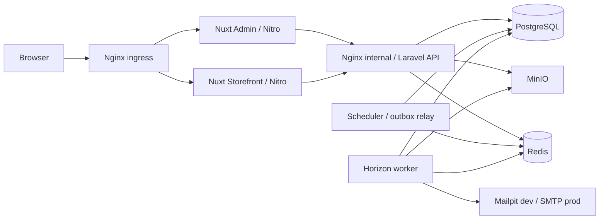

# Container diagram

```mermaid
flowchart LR
    U[Browser] --> N[Nginx ingress]
    N --> A[Nuxt Admin / Nitro]
    N --> S[Nuxt Storefront / Nitro]
    A --> L[Nginx internal / Laravel API]
    S --> L
    L --> P[(PostgreSQL)]
    L --> M[MinIO]
    L --> R[(Redis)]
    J[Scheduler / outbox relay] --> P
    J --> R
    W[Horizon worker] --> R
    W --> P
    W --> M
    W --> E[Mailpit dev / SMTP prod]
```
