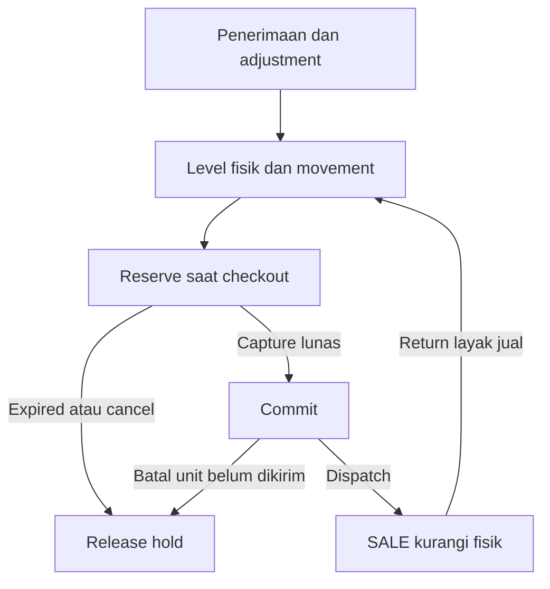

# Inventory ledger dan TTL

```mermaid
flowchart TD
    I[Penerimaan dan adjustment] --> L[Level fisik dan movement]
    L --> R[Reserve saat checkout]
    R -->|Expired atau cancel| E[Release hold]
    R -->|Capture lunas| C[Commit]
    C -->|Dispatch| S[SALE kurangi fisik]
    C -->|Batal unit belum dikirim| E
    S -->|Return layak jual| L
```

[Aturan dan recovery](../06-BUSINESS-FLOWS.md)
