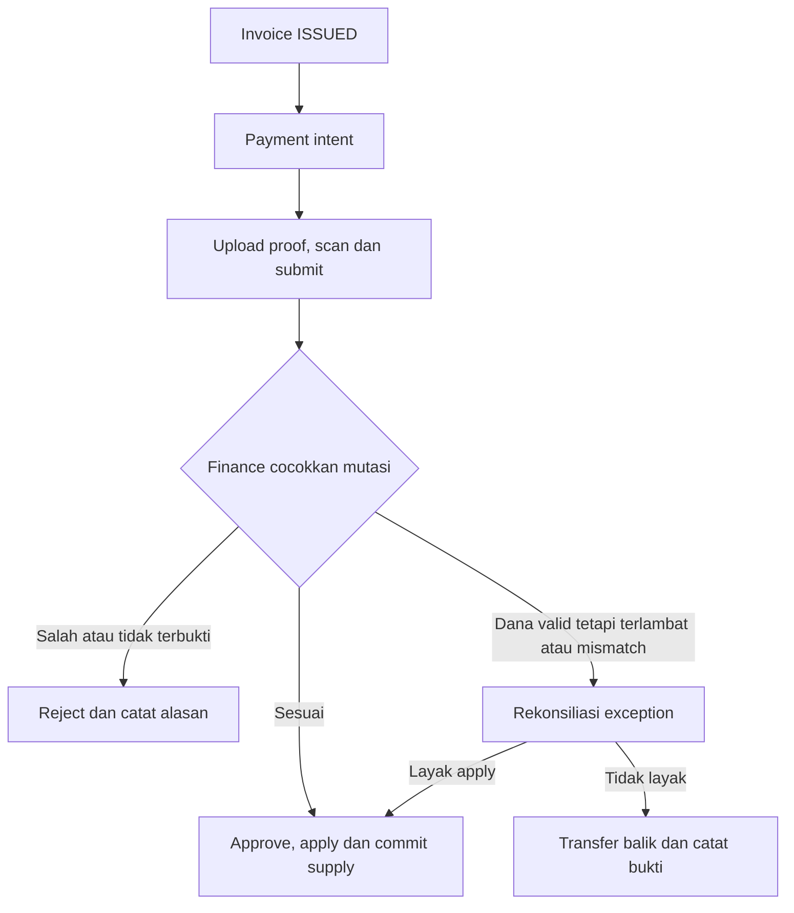

# Transfer dan verifikasi

```mermaid
flowchart TD
    I[Invoice ISSUED] --> P[Payment intent]
    P --> B[Upload proof, scan dan submit]
    B --> V{Finance cocokkan mutasi}
    V -->|Sesuai| A[Approve, apply dan commit supply]
    V -->|Salah atau tidak terbukti| R[Reject dan catat alasan]
    V -->|Dana valid tetapi terlambat atau mismatch| X[Rekonsiliasi exception]
    X -->|Layak apply| A
    X -->|Tidak layak| T[Transfer balik dan catat bukti]
```

[Aturan dan recovery](../06-BUSINESS-FLOWS.md)
