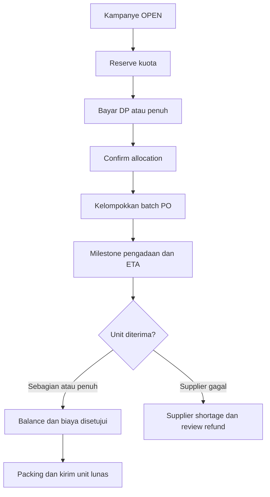

# Preorder dan pengadaan

```mermaid
flowchart TD
    O[Kampanye OPEN] --> Q[Reserve kuota]
    Q --> D[Bayar DP atau penuh]
    D --> A[Confirm allocation]
    A --> B[Kelompokkan batch PO]
    B --> T[Milestone pengadaan dan ETA]
    T --> F{Unit diterima?}
    F -->|Sebagian atau penuh| L[Balance dan biaya disetujui]
    F -->|Supplier gagal| R[Supplier shortage dan review refund]
    L --> S[Packing dan kirim unit lunas]
```

[Aturan dan recovery](../06-BUSINESS-FLOWS.md)
