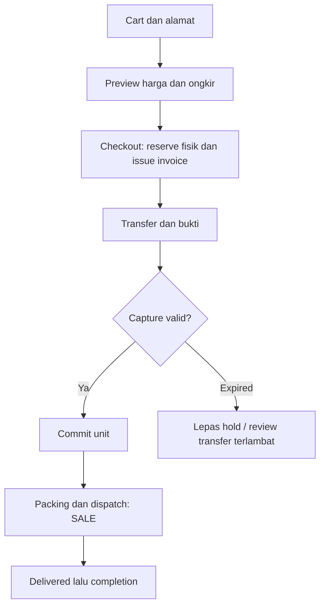

# Ready to ship

```mermaid
flowchart TD
    C[Cart dan alamat] --> V[Preview harga dan ongkir]
    V --> R[Checkout: reserve fisik dan issue invoice]
    R --> P[Transfer dan bukti]
    P --> X{Capture valid?}
    X -->|Ya| A[Commit unit]
    X -->|Expired| E[Lepas hold / review transfer terlambat]
    A --> S[Packing dan dispatch: SALE]
    S --> D[Delivered lalu completion]
```

[Aturan dan recovery](../06-BUSINESS-FLOWS.md)
