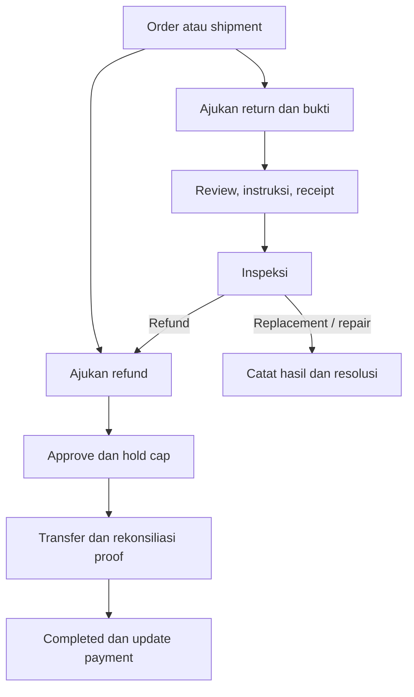

# Refund dan return

```mermaid
flowchart TD
    D[Order atau shipment] --> F[Ajukan refund]
    D --> R[Ajukan return dan bukti]
    R --> T[Review, instruksi, receipt]
    T --> I[Inspeksi]
    I -->|Refund| F
    I -->|Replacement / repair| P[Catat hasil dan resolusi]
    F --> A[Approve dan hold cap]
    A --> X[Transfer dan rekonsiliasi proof]
    X --> C[Completed dan update payment]
```

[Aturan dan recovery](../06-BUSINESS-FLOWS.md)
