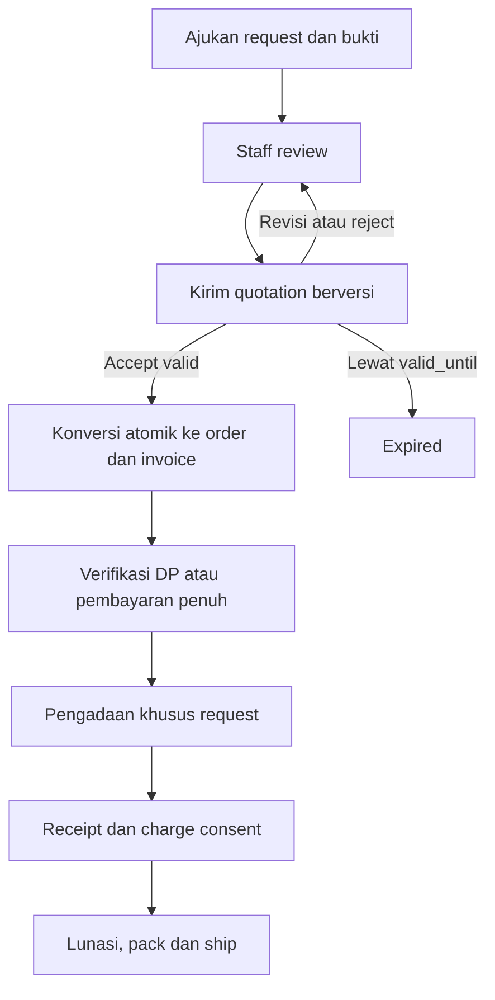

# Request order dan quotation

```mermaid
flowchart TD
    S[Ajukan request dan bukti] --> R[Staff review]
    R --> Q[Kirim quotation berversi]
    Q -->|Revisi atau reject| R
    Q -->|Accept valid| O[Konversi atomik ke order dan invoice]
    Q -->|Lewat valid_until| E[Expired]
    O --> P[Verifikasi DP atau pembayaran penuh]
    P --> B[Pengadaan khusus request]
    B --> D[Receipt dan charge consent]
    D --> C[Lunasi, pack dan ship]
```

[Aturan dan recovery](../06-BUSINESS-FLOWS.md)
