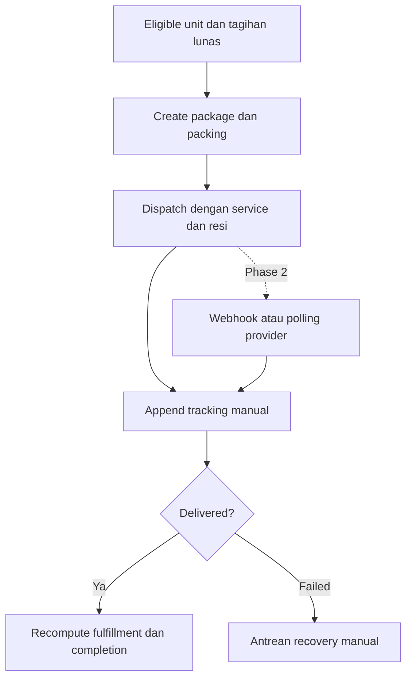

# Shipment dan tracking

```mermaid
flowchart TD
    E[Eligible unit dan tagihan lunas] --> P[Create package dan packing]
    P --> S[Dispatch dengan service dan resi]
    S --> T[Append tracking manual]
    S -. Phase 2 .-> W[Webhook atau polling provider]
    W --> T
    T --> D{Delivered?}
    D -->|Ya| C[Recompute fulfillment dan completion]
    D -->|Failed| R[Antrean recovery manual]
```

[Aturan dan recovery](../06-BUSINESS-FLOWS.md)
