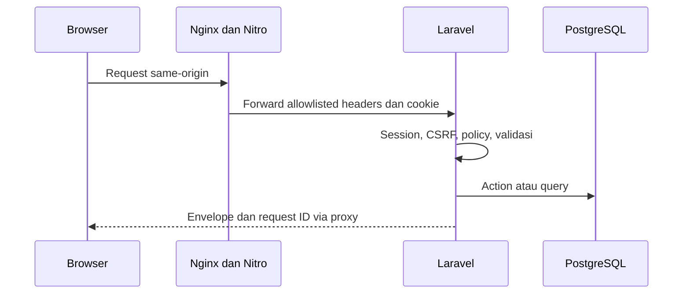
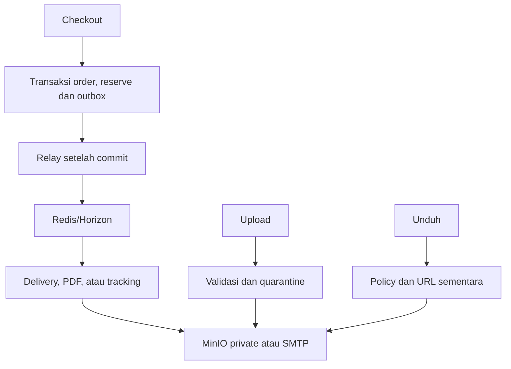
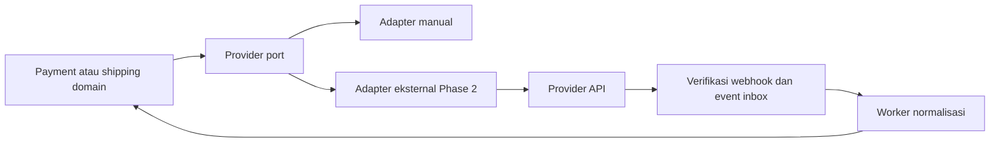

# Aliran teknis

## Request

```mermaid
sequenceDiagram
    participant B as Browser
    participant N as Nginx dan Nitro
    participant A as Laravel
    participant D as PostgreSQL
    B->>N: Request same-origin
    N->>A: Forward allowlisted headers dan cookie
    A->>A: Session, CSRF, policy, validasi
    A->>D: Action atau query
    A-->>B: Envelope dan request ID via proxy
```

## Checkout, queue dan storage

```mermaid
flowchart TD
    C[Checkout] --> T[Transaksi order, reserve dan outbox]
    T --> S[Relay setelah commit]
    S --> Q[Redis/Horizon]
    Q --> J[Delivery, PDF, atau tracking]
    J --> M[MinIO private atau SMTP]
    U[Upload] --> V[Validasi dan quarantine]
    V --> M
    R[Unduh] --> P[Policy dan URL sementara]
    P --> M
```

## Integrasi eksternal

```mermaid
flowchart LR
    D[Payment atau shipping domain] --> P[Provider port]
    P --> M[Adapter manual]
    P --> V[Adapter eksternal Phase 2]
    V --> X[Provider API]
    X --> I[Verifikasi webhook dan event inbox]
    I --> W[Worker normalisasi]
    W --> D
```
